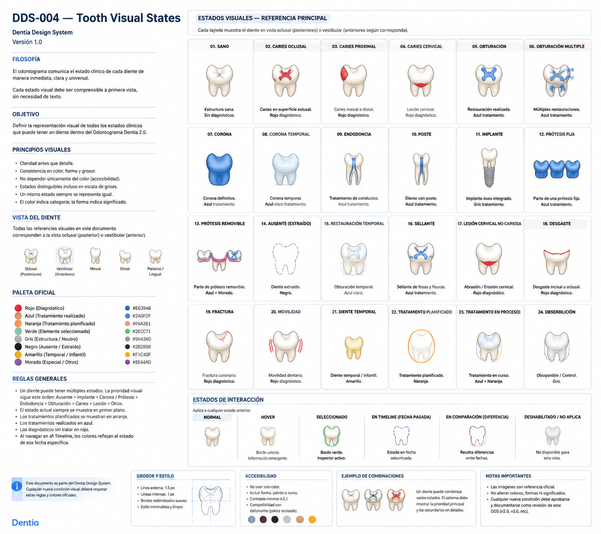

# DDS-004 — Tooth Visual States

## Dentia Design System

Versión 1.0

---

# Filosofía

El odontograma debe comunicar el estado clínico de un diente sin necesidad de leer texto.

Cada estado visual debe ser reconocible en menos de un segundo.

El color ayuda.

La forma confirma.

La iconografía complementa.

Nunca depender únicamente del color.

---

# Objetivo

Definir la representación visual oficial de todos los estados clínicos soportados por Dentia.

Este documento será la referencia única para cualquier implementación del odontograma.

---

# Prioridad visual

Cuando un diente tenga múltiples estados, la representación seguirá este orden de prioridad:

1. Ausente
2. Implante
3. Corona
4. Prótesis
5. Endodoncia
6. Restauraciones
7. Caries
8. Lesiones
9. Observaciones

La prioridad evita conflictos gráficos.

---

# Paleta oficial

## Rojo

Diagnóstico.

Nunca tratamiento.

---

## Azul

Tratamiento realizado.

---

## Naranja

Tratamiento planificado.

---

## Verde

Elemento seleccionado.

---

## Gris

Observaciones.

Estados neutros.

---

## Morado

Implantes.

---

## Amarillo

Dentición temporal.

---

# Estados visuales

## 01

Diente sano

Blanco.

Sin marcas.

---

## 02

Caries oclusal

Superficie oclusal roja.

Nunca todo el diente.

---

## 03

Caries proximal

Superficie mesial o distal en rojo.

---

## 04

Lesión cervical

Banda roja cervical.

---

## 05

Obturación simple

Superficie restaurada azul.

---

## 06

Obturaciones múltiples

Cada superficie restaurada en azul.

---

## 07

Corona definitiva

Toda la corona anatómica azul.

Raíz blanca.

---

## 08

Corona temporal

Azul claro.

Diferenciable inmediatamente.

---

## 09

Endodoncia

Canales azules.

Muy finos.

No exagerar.

---

## 10

Poste

Canal azul.

Poste gris.

---

## 11

Implante

Raíz sustituida por implante morado/gris.

Corona según corresponda.

---

## 12

Prótesis fija

Representación del puente.

No únicamente coronas aisladas.

---

## 13

Prótesis removible

Representación simplificada.

---

## 14

Ausente

Contorno gris.

Sin estructura dental.

Nunca una X gigante.

---

## 15

Restauración temporal

Azul muy claro.

---

## 16

Sellante

Pequeña marca azul sobre fosas y fisuras.

---

## 17

Lesión cervical no cariosa

Representación cervical diferenciada de la caries.

---

## 18

Desgaste

Borde incisal u oclusal resaltado.

---

## 19

Fractura

Línea roja sobre la corona.

---

## 20

Movilidad

Pequeños indicadores laterales.

Nunca mover el diente.

---

## 21

Diente temporal

Color marfil claro.

No blanco puro.

---

## 22

Tratamiento planificado

Contorno naranja.

Nunca reemplaza el diagnóstico.

---

## 23

Tratamiento en proceso

Combinación azul + naranja.

---

## 24

Observación

Pequeño indicador gris.

No competir con estados clínicos.

---

# Estados de interacción

## Normal

Sin resaltado.

---

## Hover

Ligera elevación.

Sombra suave.

Tooltip.

---

## Seleccionado

Halo verde corporativo.

Ligero aumento de tamaño.

---

## Timeline

Representación correspondiente a la fecha seleccionada.

---

## Comparador

Las diferencias se resaltan automáticamente.

---

## Deshabilitado

Gris claro.

No editable.

---

# Reglas

Un diente puede tener múltiples estados simultáneamente.

Nunca ocultar información importante.

Priorizar claridad.

Evitar contaminación visual.

Todos los iconos deberán respetar la misma línea gráfica.

---

# Accesibilidad

Todo estado debe poder distinguirse:

- por color;
- por forma;
- por patrón;
- por iconografía.

Nunca depender únicamente del color.

---

# Rendimiento

Los estados deben construirse mediante capas independientes.

No utilizar imágenes distintas para cada combinación.

DDS-001 controla la anatomía.

DDS-004 controla únicamente la representación visual.

---

# Criterios de aceptación

✅ Todos los estados clínicos tienen una representación oficial.

✅ La representación es consistente.

✅ El odontólogo identifica el estado sin leer texto.

✅ Los desarrolladores cuentan con una guía única para implementar el componente Tooth.

---

## Referencia visual oficial

> Esta imagen constituye la referencia visual oficial para la implementación de los estados clínicos del componente Tooth en Dentia.
