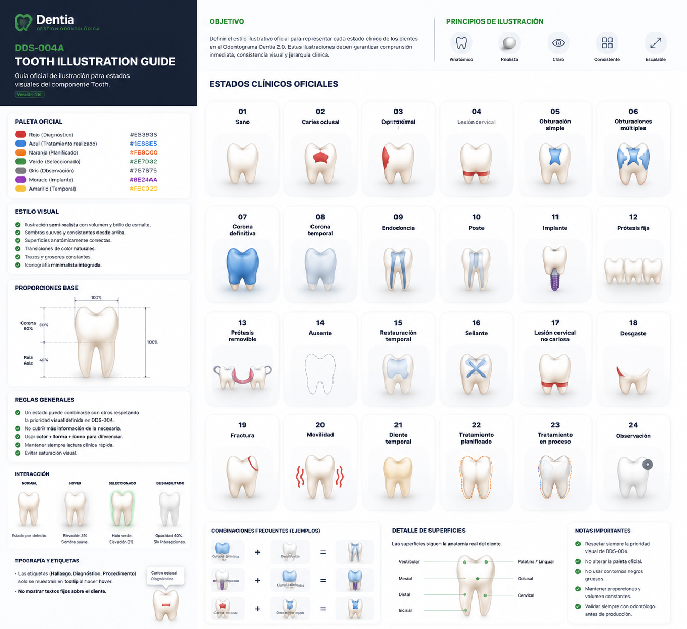

# DDS-004A — Tooth Illustration Guide

## Dentia Design System

Versión 1.0

---

# Filosofía

El componente Tooth es el elemento gráfico más importante de todo Dentia.

No debe parecer un icono.

No debe parecer un clipart.

No debe parecer una ilustración infantil.

Debe transmitir inmediatamente la sensación de un modelo anatómico moderno, limpio y clínico.

El objetivo no es impresionar visualmente.

El objetivo es que un odontólogo reconozca el estado clínico de un diente en menos de un segundo.

---

# Objetivo

Definir el lenguaje gráfico oficial del componente Tooth.

Este documento controla:

- Anatomía
- Volumen
- Sombras
- Iluminación
- Proporciones
- Bordes
- Degradados
- Iconografía
- Jerarquía visual

No define estados clínicos.

Eso pertenece a DDS-004.

---

# Principios de ilustración

Toda ilustración deberá cumplir las siguientes reglas:

• Profesional

• Minimalista

• Clínica

• Elegante

• Atemporal

• Fácil de interpretar

Nunca caricaturesca.

Nunca hiperrealista.

Nunca decorativa.

---

# Anatomía

Todos los dientes deberán respetar la anatomía real.

Dientes posteriores:

- cúspides visibles
- cuello anatómico
- raíces proporcionadas

Dientes anteriores:

- borde incisal
- cuello suave
- raíz estilizada

No utilizar formas genéricas.

Cada tipo de diente debe ser reconocible.

---

# Proporciones

La corona debe ocupar aproximadamente el 60% de la altura.

La raíz aproximadamente el 40%.

Las proporciones deben mantenerse constantes en toda la librería.

---

# Estilo visual

El diente siempre deberá mostrar:

- esmalte
- volumen
- profundidad

Utilizar:

- degradados suaves
- sombras muy ligeras
- brillo discreto

Nunca utilizar efectos exagerados.

---

# Bordes

Bordes suaves.

Nunca líneas negras gruesas.

El contorno deberá integrarse con el volumen.

---

# Paleta base

Color principal:

Blanco marfil.

No blanco puro.

Agregar ligeras variaciones cálidas.

El diente debe sentirse natural.

---

# Brillo

Agregar una iluminación superior.

Muy sutil.

El esmalte nunca debe parecer plástico.

---

# Sombras

Sombras muy suaves.

Siempre consistentes.

Nunca producir sensación de relieve exagerado.

---

# Estados clínicos

Todos los estados deberán integrarse sobre la anatomía.

Nunca reemplazar la anatomía.

La anatomía siempre permanece visible.

---

# Caries

Las lesiones deberán seguir la superficie anatómica.

Nunca utilizar figuras geométricas rígidas.

Los bordes deberán sentirse orgánicos.

---

# Obturaciones

Las restauraciones deberán integrarse al esmalte.

No parecer pegadas encima.

---

# Corona

La corona deberá cubrir únicamente la corona anatómica.

Nunca la raíz.

Debe parecer una restauración real.

No una pintura azul.

---

# Corona temporal

Mantener la misma anatomía.

Cambiar únicamente:

- color
- brillo
- textura

---

# Endodoncia

Representar únicamente los conductos.

Nunca ocultar la anatomía.

Las líneas deberán ser muy finas.

---

# Poste

Integrarse naturalmente con la endodoncia.

Nunca competir visualmente.

---

# Implante

Debe ser inmediatamente reconocible.

No utilizar símbolos abstractos.

Debe parecer un implante real simplificado.

---

# Prótesis fija

Representar la continuidad entre piezas.

No solamente múltiples coronas.

---

# Prótesis removible

Representación simplificada.

Mantener limpieza visual.

---

# Ausente

Eliminar estructura dental.

Mantener únicamente un contorno muy discreto.

Nunca utilizar una gran X.

---

# Lesión cervical

Seguir exactamente el cuello anatómico.

Nunca utilizar un rectángulo.

---

# Desgaste

Representar únicamente la superficie afectada.

No modificar el resto del diente.

---

# Fractura

Seguir trayectorias naturales.

Nunca líneas completamente rectas.

---

# Movilidad

Nunca mover realmente el diente.

Representar la movilidad mediante pequeños indicadores externos.

---

# Diente temporal

Mantener la misma anatomía.

Reducir ligeramente tamaño.

Utilizar color marfil cálido.

---

# Tratamiento planificado

Nunca reemplazar el estado actual.

Debe representarse mediante un contorno naranja muy fino.

---

# Tratamiento en proceso

Combinar discretamente:

Azul

+

Naranja

Sin perder claridad.

---

# Observaciones

Representación mínima.

Nunca competir con diagnósticos o tratamientos.

---

# Hover

Al pasar el cursor:

- aumento aproximado del 3%
- sombra ligera
- brillo ligeramente mayor

Nunca deformar el diente.

---

# Selección

La selección utiliza:

- halo verde
- sombra suave
- ligera elevación

Nunca cambiar completamente el color del diente.

---

# Jerarquía visual

El orden de lectura debe ser:

1. Anatomía

2. Diagnóstico

3. Tratamiento

4. Estado

5. Selección

Nunca invertir esta jerarquía.

---

# Consistencia

Todos los dientes deben parecer dibujados por el mismo ilustrador.

No mezclar estilos.

No mezclar grosores.

No mezclar sombras.

---

# Escalabilidad

El componente debe conservar su calidad visual desde:

40 px

hasta

200 px

Sin perder legibilidad.

---

# Accesibilidad

Toda diferencia importante deberá poder distinguirse mediante:

- color
- forma
- patrón
- iconografía

Nunca depender únicamente del color.

---

# Relación con otros DDS

DDS-001

Define la arquitectura del componente Tooth.

DDS-004

Define los estados clínicos.

DDS-004A

Define la calidad artística oficial de toda la librería gráfica.

Los tres documentos deberán utilizarse conjuntamente.

---

# Referencia visual oficial

> Esta ilustración constituye la referencia oficial para la anatomía, proporciones, sombras, volumen y representación gráfica del componente Tooth dentro del Dentia Design System.

La imagen:

DDS-004A-Tooth-Illustration-Guide-Reference.png

constituye la referencia gráfica oficial.

Cuando exista cualquier duda entre el código y la ilustración:

La ilustración tiene prioridad.

---

# Criterios de aceptación

✅ El componente Tooth transmite inmediatamente profesionalismo.

✅ Los dientes parecen modelos clínicos modernos.

✅ Los estados clínicos se integran naturalmente con la anatomía.

✅ La lectura clínica es inmediata.

✅ Toda la librería mantiene exactamente el mismo estilo gráfico.

---

# Observación

DDS-004A constituye la guía oficial de ilustración del Dentia Design System.

A partir de este documento ninguna modificación gráfica del componente Tooth deberá realizarse sin respetar simultáneamente:

- DDS-001
- DDS-004
- DDS-004A

Este documento marca el estándar visual definitivo para el Odontograma Dentia 2.0.
