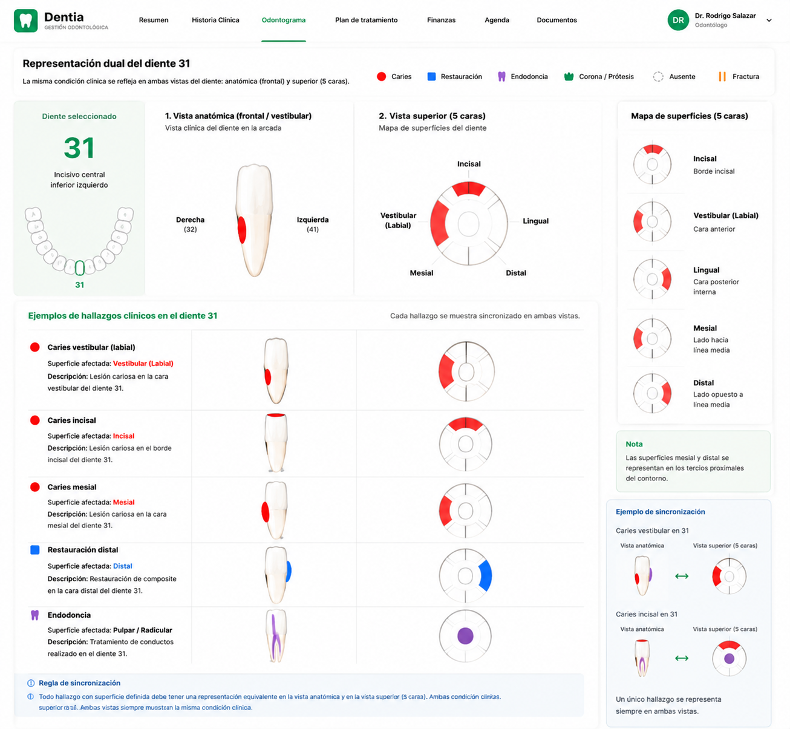
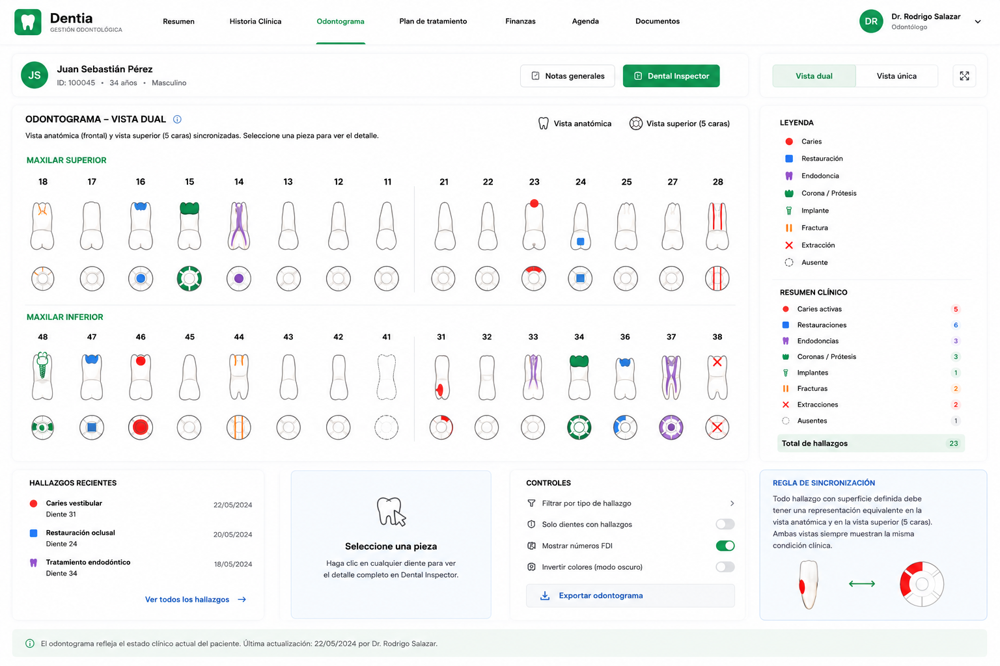

# DDS-005A — Dual Clinical Tooth Representation

## Dentia Design System

**Versión:** 1.0  
**Estado:** Diseño aprobado pendiente de implementación

---

## 1. Propósito

Definir la representación clínica dual oficial de cada pieza dental dentro del odontograma principal de Dentia.

Cada pieza deberá mostrar simultáneamente:

1. Una vista anatómica esquemática.
2. Una vista superior o mapa clínico de cinco caras.

Ambas vistas deberán permanecer sincronizadas y representar el mismo estado clínico vigente.

---

## 2. Principio fundamental

Un evento odontográfico es una única fuente de verdad clínica.

Las vistas anatómica y superior no son registros independientes.

El flujo correcto es:

```text
Evento odontográfico real
          ↓
Modelo clínico de la pieza
          ├── Vista anatómica
          └── Vista superior de cinco caras
```

Nunca debe registrarse un hallazgo por separado para cada vista.

---

## 3. Objetivo clínico

La representación dual debe permitir que el odontólogo responda rápidamente:

- qué tiene la pieza;
- en qué superficie se encuentra;
- si corresponde a diagnóstico, tratamiento o estado estructural;
- si existe coherencia entre ambas representaciones.

La claridad clínica tiene prioridad sobre la estética.

---

## 4. Vista anatómica esquemática

La vista anatómica representa la pieza dentro de la arcada.

Debe ser:

- plana;
- esquemática;
- sin perspectiva ambigua;
- diferenciada por familia dental;
- compatible con nomenclatura FDI.

Debe permitir representar, cuando aplique:

- caries visibles en superficie anatómica;
- restauraciones;
- coronas;
- endodoncias;
- implantes;
- fracturas;
- extracciones;
- ausencias;
- prótesis;
- estados estructurales.

No debe utilizar el Tooth Component 3D como representación principal del odontograma.

---

## 5. Vista superior de cinco caras

Cada pieza tendrá un mapa de cinco superficies.

La estructura general será:

- superficie central: oclusal o incisal;
- superficie vestibular;
- superficie palatina o lingual;
- superficie mesial;
- superficie distal.

La orientación debe adaptarse correctamente a:

- cuadrante;
- maxilar;
- tipo de pieza;
- dentición permanente o temporal.

La ubicación de cada marca debe ser inequívoca.

---

## 6. Regla de sincronización

Todo evento con una superficie definida deberá tener una representación equivalente en ambas vistas cuando clínicamente aplique.

Ejemplo:

```text
Diente 31
Diagnóstico: Caries activa
Superficie: Vestibular
```

Debe producir:

- marca vestibular en la vista anatómica;
- marca en el segmento vestibular del mapa de cinco caras.

No debe ocurrir que una vista muestre el hallazgo y la otra permanezca sana sin una razón clínica documentada.

---

## 7. Casos por superficie

### Vestibular

Debe representarse:

- en la cara vestibular de la vista anatómica;
- en el segmento vestibular del mapa de cinco caras.

### Palatina o lingual

Debe representarse:

- en la cara interna correspondiente de la vista anatómica;
- en el segmento palatino o lingual del mapa.

### Mesial

Debe representarse:

- en la zona proximal hacia la línea media;
- en el segmento mesial del mapa.

### Distal

Debe representarse:

- en la zona proximal opuesta a la línea media;
- en el segmento distal del mapa.

### Oclusal o incisal

Debe representarse:

- sobre la superficie o borde correspondiente en la vista anatómica;
- en la superficie central del mapa de cinco caras.

---

## 8. Diagnósticos

### Caries

Color oficial:

- rojo.

Debe poder aplicarse a una o varias superficies.

La misma selección de superficies debe reflejarse en ambas vistas.

### Fractura

Debe utilizar una convención clínica inequívoca.

La representación dependerá de su localización y extensión.

### Lesiones cervicales

Deben ubicarse en la zona cervical y no confundirse con superficies oclusales, vestibulares o furca.

### Lesiones periapicales

Deben representarse en relación con la raíz o el ápice.

No deben pintarse como lesiones coronarias.

### Furca

Debe utilizar simbología periodontal específica.

No debe confundirse con una lesión lingual, palatina o cervical.

---

## 9. Tratamientos

### Restauración

Color oficial:

- azul.

Debe representar las superficies restauradas en ambas vistas.

### Corona

Debe modificar la representación coronaria anatómica.

En el mapa superior debe existir una convención coherente de pieza completa.

### Endodoncia

Debe representarse en la estructura radicular o pulpar.

La vista de cinco caras puede mostrar un indicador central o estructural, sin inventar una superficie.

### Implante

Debe representarse claramente en la vista anatómica.

La vista superior debe mostrar el estado estructural de pieza completa.

### Extracción o ausencia

Debe mostrarse en ambas vistas mediante una convención inequívoca.

---

## 10. Eventos sin superficie

Cuando un evento requiera superficie y ésta no haya sido registrada:

- no inventar oclusal;
- no inventar vestibular;
- no inventar mesial, distal, palatina o lingual.

Debe utilizarse:

- un indicador general claramente identificado;
- tooltip;
- historial;
- Dental Inspector.

El sistema debe promover completar la superficie sin falsear información clínica.

---

## 11. Eventos no superficiales

Diagnósticos como:

- pulpitis;
- necrosis pulpar;
- dolor;
- sensibilidad;
- observaciones clínicas;

no deben inventar una marca superficial.

Pueden representarse mediante:

- indicador informativo;
- contador;
- tooltip;
- Dental Inspector;
- historial.

---

## 12. Selección e interacción

Al seleccionar una pieza:

- ambas vistas deben resaltarse;
- debe actualizarse el panel contextual;
- debe mantenerse el mismo número FDI;
- debe mostrarse la información clínica correspondiente.

El hover debe ofrecer información rápida sin modificar el estado.

---

## 13. Relación con Dental Inspector

El odontograma dual responde:

> ¿Qué tiene esta pieza y en qué superficie?

El Dental Inspector responde:

> ¿Cuál es la historia completa de esta pieza?

Dental Inspector podrá mostrar:

- Tooth Component anatómico avanzado;
- estado actual;
- diagnósticos;
- tratamientos;
- historial;
- evolución;
- fotografías;
- radiografías;
- observaciones.

---

## 14. Uso del Tooth Component avanzado

El Tooth Component desarrollado anteriormente se conserva.

No debe repetirse como mapa principal de las 32 piezas.

Se utilizará dentro de:

- Dental Inspector;
- modo paciente;
- comparación;
- evolución;
- explicación anatómica;
- especialidades futuras.

---

## 15. Denticiones soportadas

La solución dual deberá soportar:

- dentición permanente;
- dentición temporal;
- dentición mixta.

Debe respetar la nomenclatura FDI correspondiente.

---

## 16. Fuente de verdad

La fuente de verdad sigue siendo:

- eventos odontográficos reales;
- estado confirmado;
- reconstrucción histórica del backend.

Las dos vistas se generan desde el mismo modelo clínico.

No crear dos bases de datos visuales ni dos registros independientes.

---

## 17. Rendimiento

Cada pieza deberá actualizarse de forma independiente cuando cambie su estado.

No redibujar todo el odontograma innecesariamente.

La sincronización entre vistas debe ocurrir dentro del mismo componente clínico de pieza.

---

## 18. Accesibilidad

La interpretación no debe depender exclusivamente del color.

Debe apoyarse también en:

- forma;
- patrón;
- símbolo;
- ubicación;
- tooltip.

---

## 19. Referencias visuales oficiales

### Detalle de una pieza dual



Esta imagen define la sincronización esperada entre la vista anatómica y el mapa de cinco caras.

### Vista general del odontograma dual



Esta imagen define la composición conceptual del odontograma completo con las 32 piezas y sus dos vistas.

Los mockups son referencias de diseño y no autorizan inventar funciones no documentadas.

---

## 20. Criterios de aceptación

La representación dual será aprobada cuando:

- un único evento se refleje en ambas vistas;
- la superficie sea inequívoca;
- no existan contradicciones;
- el odontólogo pueda interpretar la pieza sin explicación adicional;
- ambas vistas persistan correctamente después de recargar;
- se integren con el Dental Inspector;
- el Tooth Component avanzado conserve su función de detalle.

---

## 21. Regla final

Nunca registrar dos veces el mismo hallazgo para alimentar las dos vistas.

Un evento clínico.

Dos representaciones sincronizadas.

Una sola fuente de verdad.
