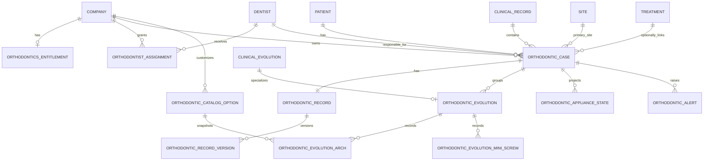

# ORT-0 — Contrato funcional y arquitectura del módulo de Ortodoncia

**Estado:** diseño funcional y técnico propuesto para revisión; sin implementación

**Fecha:** 2026-09-14

**Alcance:** Colombia y Chile, con terminología localizada

**Siguiente fase permitida:** ORT-1, únicamente después de resolver las decisiones clínicas señaladas y recibir autorización explícita

## 1. Objetivo

Definir el contrato funcional, clínico y de arquitectura de un módulo opcional de Ortodoncia para Dentia. El módulo debe integrarse con el expediente existente sin convertirse en una historia clínica paralela, preservar la trazabilidad de la atención y permitir una habilitación comercial por empresa y por odontólogo.

ORT-0 es exclusivamente una fase de diseño. Este documento no crea modelos, migraciones, endpoints, permisos, componentes de interfaz, flags, planes ni precios.

## 2. Fuentes revisadas

### 2.1 Fuente clínica primaria

Se revisó íntegramente el archivo original `dentia ortodoncia.docx`, aportado por un odontólogo de Chile para el levantamiento. Los dos ejemplares localizados eran byte a byte idénticos:

| Dato | Valor |
|---|---|
| Nombre | `dentia ortodoncia.docx` |
| SHA-256 | `f5e43316d56507fbb987870934ec85bc27caaf3194d0e3a6aa4250819f7f3ca8` |
| Tratamiento | Fuente de requerimientos; no se copia al repositorio ni se usa como storage clínico |

Convenciones interpretadas del documento fuente:

- `•` representa una alternativa de selección única, salvo que una validación clínica posterior determine otra cosa.
- `-` representa una alternativa de selección múltiple.
- una caja o línea en blanco representa entrada manual.
- `+ Nueva opción` representa un catálogo extensible por tenant, no texto libre incrustado en el esquema.

Estas convenciones describen la intención del formulario original; no sustituyen la validación clínica de obligatoriedad, exclusión mutua o compatibilidad entre valores.

### 2.2 Arquitectura existente revisada

Se contrastó el diseño con:

- `backend/app/models/clinical_record.py` y el ciclo de vida de `ClinicalEvolution`.
- `backend/app/services/clinical_record_service.py`, incluida firma, hash, addenda, bloqueo y auditoría.
- `backend/app/models/treatment.py`, tratamientos y procedimientos.
- `backend/app/models/agenda.py`, pacientes, odontólogos, sedes y citas.
- `backend/app/models/company.py` y la cuota actual de odontólogos.
- `backend/app/core/security_catalog.py` y los roles empresariales vigentes.
- `frontend/components/patients/PatientDetail.tsx` y la navegación actual del expediente.
- contratos existentes de evolución clínica, historia clínica e integración clínica-comercial.

Hallazgos que condicionan el diseño:

1. `ClinicalEvolution` ya es la fuente canónica para una evolución, con estados `DRAFT`, `SIGNED` y anulación compensatoria, firma, hash, addenda, timeline y auditoría.
2. Tratamientos, procedimientos, citas, sedes y profesionales ya tienen identidad propia y no deben duplicarse dentro de Ortodoncia.
3. La cuota comercial actual limita odontólogos activos de la empresa; una licencia de Ortodoncia es una capacidad diferente y requiere su propio entitlement.
4. No existe todavía un repositorio clínico genérico de radiografías o archivos diagnósticos listo para ser reutilizado. ORT-0 no debe crear un storage paralelo.
5. Los roles vigentes son `ADMINISTRATOR`, `DENTIST_ADMIN`, `DENTIST`, `SECRETARY` y `PLATFORM_ADMIN`.

## 3. Decisiones rectoras

| Tema | Decisión ORT-0 |
|---|---|
| Naturaleza del módulo | Bounded context clínico especializado, integrado con el expediente común |
| Habilitación comercial | Add-on opcional por empresa, con cupo de odontólogos asignados |
| Autorización | Entitlement, permiso RBAC y scope clínico son controles distintos y acumulativos |
| Entrada UI | Pestaña dentro del detalle del paciente; no módulo global en el sidebar para el MVP |
| Caso clínico | Un caso de Ortodoncia activo por paciente y varios casos históricos cerrados |
| Evolución | Extensión especializada 1:1 de `ClinicalEvolution`; no segunda evolución independiente |
| Historia/Ficha | Registro especializado versionado por caso; Colombia y Chile comparten modelo interno |
| Resumen | Proyección derivada; no nueva fuente de verdad |
| Datos estructurados | Modelo híbrido: entidades relacionales + snapshots JSONB versionados y validados |
| Catálogos | Opciones base Dentia y opciones tenant, retirables pero no borrables si fueron usadas |
| Archivos diagnósticos | Referencias preparadas para un repositorio clínico común futuro; sin storage paralelo |
| Inmutabilidad | Evoluciones firmadas y versiones finalizadas no se editan; correcciones por addenda o nueva versión |
| Plataforma | Administra entitlements, pero no obtiene acceso clínico tenant |

## 4. Límites del bounded context

### 4.1 Responsabilidad de Ortodoncia

Ortodoncia es responsable de:

- habilitación del add-on y asignación de plazas a odontólogos;
- caso ortodóntico y su ciclo de vida;
- ficha/historia clínica especializada de Ortodoncia;
- evoluciones ortodónticas estructuradas;
- estado actual de aparatología y alertas ortodónticas;
- catálogos clínicos específicos del módulo;
- resumen derivado del caso;
- auditoría propia de acciones del módulo.

### 4.2 Responsabilidades que permanecen fuera

| Contexto existente | Sigue siendo dueño de |
|---|---|
| Pacientes | identidad, documento, contacto, demografía y expediente del paciente |
| Empresas | tenant, país, zona horaria y estado empresarial |
| Sedes | sede asistencial y reglas de acceso |
| Odontólogos | identidad profesional, vínculo con usuario y sedes |
| Agenda | citas y disponibilidad |
| Historia Clínica | `ClinicalRecord`, evolución canónica, firma, addenda y timeline |
| Tratamientos | plan de tratamiento, procedimientos y estado clínico-comercial |
| Documentos | documentos narrativos y PDFs clínicos ya soportados |
| Archivos clínicos futuros | imágenes, radiografías y otros binarios diagnósticos |
| Consentimientos | plantillas, instancias y aceptación del consentimiento |

Ortodoncia puede referenciar estas entidades por identificador, pero no replicar sus datos mutables como fuente primaria.

### 4.3 Invariantes

1. Toda fila clínica pertenece a una empresa y a un paciente verificables en backend.
2. Un usuario nunca obtiene acceso por tener solo el add-on o solo un permiso.
3. Toda escritura clínica exige: tenant habilitado, odontólogo asignado, permiso, scope de empresa/sede/paciente y estado compatible.
4. Retirar una plaza no borra ni oculta la historia existente.
5. Una evolución ortodóntica firmada es una `ClinicalEvolution` firmada y no una firma paralela.
6. El resumen nunca puede editarse directamente.
7. Un snapshot de catálogo conserva código y etiqueta usados en el momento clínico.
8. Ninguna acción de `PLATFORM_ADMIN` concede acceso al contenido clínico del tenant.

### 4.4 Flujo de alto nivel

```text
Empresa con entitlement de Ortodoncia
                 │
                 ├── cupo contratado
                 └── asignaciones activas a odontólogos
                                  │
Paciente ── ClinicalRecord ── OrthodonticCase
                                  ├── OrthodonticRecord
                                  │      └── versiones inmutables
                                  ├── ClinicalEvolution
                                  │      └── extensión OrthodonticEvolution
                                  ├── estado de aparatología
                                  ├── alertas
                                  └── resumen derivado
```

## 5. Experiencia funcional dentro del paciente

### 5.1 Entrada

Agregar conceptualmente una pestaña `Ortodoncia` como par de Historia Clínica, Odontograma, Tratamientos y Documentos dentro del detalle del paciente.

La pestaña se muestra cuando se cumple al menos una condición:

- la empresa tiene el add-on activo y el usuario tiene permiso de lectura aplicable; o
- existe historia ortodóntica previa accesible para ese usuario, aunque la licencia haya sido retirada, en modo de solo lectura.

No debe mostrarse un enlace clínico funcional a `PLATFORM_ADMIN` por su rol global.

### 5.2 Navegación interna

El módulo usa tres vistas:

1. `Resumen`.
2. `Evolución`.
3. Nombre localizado del registro especializado:
   - Colombia: `Historia clínica de Ortodoncia`.
   - Chile: `Ficha clínica de Ortodoncia`.

El nombre cambia por país de la empresa; el modelo, las APIs y los códigos internos no cambian.

### 5.3 Estados de acceso

| Estado | Comportamiento |
|---|---|
| Empresa sin add-on y sin historia | pestaña no disponible; superficie comercial separada, sin filtrar datos clínicos |
| Empresa con add-on, usuario sin permiso | acceso denegado |
| Empresa con add-on, profesional sin plaza | lectura si su RBAC/scope lo permiten; creación y firma bloqueadas |
| Plaza retirada con historia existente | lectura histórica preservada; nuevas escrituras bloqueadas |
| Caso cerrado | lectura completa; nuevo caso mediante acción explícita y reglas clínicas |

## 6. Modelo de entitlement y plazas

### 6.1 Entidades conceptuales

#### `OrthodonticsEntitlement`

Una fila vigente por empresa:

- `id`.
- `company_id`, único.
- `status`: `ACTIVE`, `SUSPENDED` o `DISABLED`.
- `seat_limit`, entero positivo.
- `effective_from` y `effective_until`, opcionales.
- `version`, para concurrencia optimista.
- `configured_by_user_id`.
- timestamps.

No contiene precios ni datos de facturación. El cupo es una capacidad técnica configurable por Plataforma.

#### `OrthodontistAssignment`

Registro histórico de una plaza asignada:

- `id`.
- `company_id`.
- `dentist_id`.
- `assigned_at`, `assigned_by_user_id`.
- `revoked_at`, `revoked_by_user_id`, `revocation_reason`.
- índice único parcial para impedir dos asignaciones activas del mismo odontólogo.

Las asignaciones no se eliminan. Una reasignación revoca la anterior y crea otra dentro de la misma transacción.

### 6.2 Reglas transaccionales

Asignar una plaza exige:

1. bloquear la fila del entitlement de la empresa;
2. verificar estado `ACTIVE` y vigencia temporal;
3. verificar que el odontólogo y su usuario activo pertenecen a la misma empresa;
4. contar asignaciones activas;
5. rechazar si `active_assignments >= seat_limit`;
6. crear la asignación y su auditoría en una sola transacción.

Reducir el cupo por debajo de las asignaciones activas debe rechazarse. No se seleccionan ni revocan profesionales automáticamente.

Una plaza no es transferible entre empresas. La asignación tampoco sustituye el scope por sede ni el estado activo del odontólogo.

### 6.3 Separación de controles

| Control | Pregunta que responde | Ejemplo |
|---|---|---|
| Entitlement de empresa | ¿La clínica contrató y tiene habilitado el módulo? | `OrthodonticsEntitlement.ACTIVE` |
| Plaza personal | ¿Este odontólogo consume una plaza y puede operar el módulo? | asignación activa |
| RBAC | ¿Qué acción puede ejecutar? | `orthodontics.evolution.sign` |
| Scope | ¿Sobre qué tenant, sede, paciente o caso puede actuar? | empresa/sedes autorizadas |
| Estado clínico | ¿La acción es válida en este momento? | caso activo, evolución en borrador |

La autorización efectiva es la intersección de todos los controles aplicables.

## 7. Propuesta RBAC

Los nombres son contrato propuesto para ORT-1; ORT-0 no los persiste.

### 7.1 Permisos propuestos

- `orthodontics.entitlement.view`
- `orthodontics.entitlement.manage`
- `orthodontics.assignment.view`
- `orthodontics.assignment.manage`
- `orthodontics.case.view`
- `orthodontics.case.create`
- `orthodontics.case.manage`
- `orthodontics.record.view`
- `orthodontics.record.edit_draft`
- `orthodontics.record.finalize`
- `orthodontics.evolution.view`
- `orthodontics.evolution.create`
- `orthodontics.evolution.sign`
- `orthodontics.alert.manage`
- `orthodontics.catalog.view`
- `orthodontics.catalog.manage`

### 7.2 Matriz propuesta

`A` significa administrativo, `C` clínico y `—` sin asignación por defecto.

| Capacidad | ADMINISTRATOR | DENTIST_ADMIN | DENTIST | SECRETARY | PLATFORM_ADMIN |
|---|---:|---:|---:|---:|---:|
| Ver entitlement/cupo propio | A | A | — | — | — |
| Configurar cupo comercial | — | — | — | — | A |
| Ver/asignar plazas del tenant | A | A | — | — | — |
| Ver catálogos | A | A/C | C | — | — |
| Gestionar catálogo tenant | A | A | — | — | — |
| Ver casos/registros/evoluciones | — por defecto | C | C | — | — |
| Crear/gestionar caso | — por defecto | C | C | — | — |
| Editar/finalizar registro | — por defecto | C | C | — | — |
| Crear/firmar evolución | — por defecto | C | C | — | — |
| Gestionar alertas clínicas | — por defecto | C | C | — | — |

Reglas adicionales:

- `DENTIST` y `DENTIST_ADMIN` necesitan asignación activa para crear, finalizar o firmar.
- Tener `DENTIST_ADMIN` no evita el consumo de plaza cuando realiza actividad ortodóntica.
- `ADMINISTRATOR` puede gestionar entitlement visible, asignaciones y catálogos sin adquirir acceso a pacientes. Si también es odontólogo debe actuar con su identidad clínica, permisos clínicos y plaza propios.
- `PLATFORM_ADMIN` solo administra la capacidad comercial global. No ve asignaciones clínicas detalladas más allá de identificadores administrativos mínimos si no fueran necesarios, y nunca ve casos o pacientes.
- `SECRETARY` no recibe permisos clínicos de Ortodoncia en el MVP. Una integración futura con Agenda no implica acceso a la ficha.

## 8. Caso ortodóntico

### 8.1 Entidad raíz

`OrthodonticCase` es el aggregate root clínico:

- `id`, `company_id`, `patient_id`.
- `clinical_record_id`.
- `responsible_dentist_id`.
- `primary_site_id`.
- `primary_treatment_id`, opcional.
- `status`.
- `started_at`, `completed_at`.
- `closure_reason_code`, `closure_notes`.
- `last_clinical_activity_at`.
- `version`.
- actores y timestamps de creación/actualización.

### 8.2 Ciclo de vida

Estados mínimos:

```text
DRAFT ──activar──> ACTIVE ──suspender──> SUSPENDED
                     ▲                      │
                     └────────reanudar──────┘

ACTIVE o SUSPENDED ──cerrar──> COMPLETED
```

Reglas:

- solo puede existir un caso no cerrado (`DRAFT`, `ACTIVE` o `SUSPENDED`) por empresa y paciente;
- pueden existir múltiples casos `COMPLETED` históricos;
- un `DENTIST` o `DENTIST_ADMIN` con permiso clínico, plaza activa y scope válido puede abrir y activar el caso;
- cerrar, suspender o reanudar exige las mismas condiciones clínicas y una confirmación explícita; `ADMINISTRATOR` sin identidad odontológica no puede hacerlo;
- un caso `COMPLETED` no se reabre: una nueva necesidad crea otro caso;
- abandono, traslado, alta y finalización terapéutica se modelan como motivos de cierre, no como estados adicionales en el MVP;
- un caso suspendido admite consulta y preparación controlada, pero no firma de nueva atención salvo reanudación explícita;
- cambiar el responsable exige profesional activo, plaza activa, scope válido y auditoría. No cambia la autoría histórica.

La obligatoriedad de un diagnóstico inicial o un plan formal para pasar de `DRAFT` a `ACTIVE` queda pendiente de validación clínica.

## 9. Contrato del Resumen

`Resumen` es una vista derivada del caso. No tiene formulario propio ni duplica datos.

| Bloque | Fuente canónica | Regla de proyección |
|---|---|---|
| Estado del caso | `OrthodonticCase` | estado y fechas vigentes |
| Diagnóstico/plan | última versión finalizada del registro + tratamiento vinculado | extracto clínico, sin sustituir Tratamientos |
| Aparatología actual | `OrthodonticApplianceState` | proyección actualizada solo desde evoluciones firmadas |
| Última atención | `ClinicalEvolution` firmada con extensión ortodóntica | más reciente por fecha clínica e identificador estable |
| Lo realizado | última evolución ortodóntica firmada | narrativa y datos estructurados |
| Próximo control | última indicación firmada | intervalo/fecha indicada, no una cita implícita |
| Próxima cita | Agenda | primera cita futura compatible del caso/paciente |
| Alertas | `OrthodonticAlert` | abiertas, ordenadas por severidad y fecha |
| Profesional responsable | caso + Dentist | identidad profesional vigente |

### 9.1 Estado de aparatología

La proyección de aparatología es explícita porque una evolución puede declarar `Sin cambios`. Debe conservar el último estado confirmado por arcada sin inferirlo de texto libre.

`OrthodonticApplianceState` mantiene, por caso y arcada, el material/tamaño vigente y su procedencia (`source_orthodontic_evolution_id`). Solo una evolución firmada puede actualizarlo. Una corrección requiere addendum y, cuando cambie el estado vigente, una operación compensatoria auditada definida en ORT-3.

## 10. Evolución ortodóntica

### 10.1 Relación con `ClinicalEvolution`

Se adopta una extensión 1:1:

```text
ClinicalEvolution (canónica)
    1 ───────── 0..1 OrthodonticEvolution (especialización)
```

El padre conserva:

- paciente, empresa, sede y profesional;
- fecha clínica y zona horaria;
- narrativa principal;
- vínculo a cita, tratamiento y procedimiento;
- borrador, firma, anulación compensatoria y versión;
- hash, timeline, auditoría y addenda.

La extensión conserva únicamente datos estructurados específicos de Ortodoncia y `orthodontic_case_id`.

No se permite crear una extensión sin su evolución padre ni asociarla a un padre de otro tenant, paciente, sede o profesional.

### 10.2 Firma atómica

La firma debe reutilizar la orquestación de `ClinicalEvolution`:

1. bloquear padre y extensión;
2. verificar caso, entitlement, plaza, RBAC, scope y completitud;
3. canonicalizar el payload ortodóntico con versión de esquema;
4. calcular su hash;
5. incluir `orthodontic_schema_version` y `orthodontic_payload_hash` en el material canónico del padre;
6. firmar padre y extensión en una transacción;
7. actualizar proyecciones del caso, aparatología y alertas;
8. registrar timeline y auditoría;
9. hacer rollback completo si falla cualquier paso.

Una evolución firmada no se edita. La narrativa se corrige mediante el mecanismo de addenda existente. Una corrección estructurada que cambie el estado vigente requiere una regla compensatoria explícita en ORT-3; no se debe mutar el JSON firmado.

### 10.3 Campos de evolución tomados de la fuente

La UI puede presentar las listas originales, pero el modelo debe separar material/tamaño de los comandos `Sin arco` y `Sin cambios`. Esto evita guardar una acción como si fuera una propiedad física. La etiqueta original queda preservada en el snapshot clínico.

#### Arco superior e inferior

Ambas arcadas reutilizan las mismas categorías y se diferencian por `arch=UPPER|LOWER`; no se duplican catálogos.

| Campo | Tipo inicial | Opciones exactas de la fuente |
|---|---|---|
| Material | selección única extensible | `Acero`, `Arco estético`, `Bioforce`, `Bio memalloy`, `Blue elgilloy`, `Braided`, `Curva reversa`, `DKL`, `Memalloy`, `Niti natural`, `Niti térmico`, `Niti cu`, `Neosentalloy`, `Sentalloy`, `Tri memalloy`, `TMA / Resolve`, `SKL`, `Con poste`, `Sin arco`, `Sin cambios`, `+ nueva opción` |
| Tamaño | selección única extensible | `.012`, `.014`, `.016`, `.018`, `.020`, `.016 x .016`, `.016 x .022`, `.017 x .025`, `.018 x .025`, `.019 x .019`, `.019 x .025`, `.020 x .020`, `.021 x .025`, `.022 x .028`, `Sin arco`, `Sin cambios`, `+ nueva opción` |

`NO_ARCH` no debe traducirse automáticamente como ausencia dental ni como decisión terapéutica sin validación clínica. `NO_CHANGE` debe conservar el último estado vigente de esa arcada. Falta confirmar si material y tamaño deben usar siempre el mismo comando en una evolución.

#### Ortodoncia invisible, elásticos y microtornillos

| Grupo | Campo | Tipo inicial | Valores/regla |
|---|---|---|---|
| Ortodoncia invisible | Alineador superior | manual | texto/número/identificador pendiente de definición |
| Ortodoncia invisible | Alineador inferior | manual | texto/número/identificador pendiente de definición |
| Elásticos | Tipo de elásticos | manual | no convertir en catálogo cerrado sin confirmación |
| Elásticos | Configuración de elásticos | manual | representación anatómica y estructura pendientes |
| Microtornillo | Tipo | selección única por tornillo | `Autoroscante`, `Autoperforante` |
| Microtornillo | Ubicación | selección única por tornillo | `Interradicular`, `Palatino`, `Retromolar`, `Infrazigomática o alveolar anterior` |
| Microtornillo | Material | selección única por tornillo | `Titanio`, `Acero` |
| Microtornillo | Medida | manual | unidad y formato pendientes |

Una evolución puede contener cero o varios microtornillos. No se modelan como un único scalar del caso.

#### Próxima sesión y alertas

| Campo | Tipo inicial | Valores/regla |
|---|---|---|
| Indicaciones próxima sesión | texto clínico | parte del contenido firmado |
| Próximo control | selección única extensible | `1 semana`, `2 semanas`, `3 semanas`, `4 semanas`, `5 semanas`, `6 semanas`, `2 meses`, `3 meses`, `4 meses`, `5 meses`, `6 meses`, `7 meses`, `8 meses`, `9 meses`, `10 meses`, `11 meses`, `12 meses`, `+ nueva opción` |
| Fecha exacta propuesta | fecha local confirmable | se puede sugerir desde el intervalo; no se firma sin confirmación del usuario |
| Cita vinculada | referencia opcional | no se crea automáticamente; CTA `Agendar próximo control` |
| Alerta | entidad de caso | texto, estado, severidad y vencimiento; taxonomía pendiente de confirmación |

### 10.4 Entidades auxiliares

- `OrthodonticEvolutionArch`: una fila por arcada `UPPER`/`LOWER`, con modo de cambio y snapshots de material/tamaño.
- `OrthodonticEvolutionMiniScrew`: cero o varias filas; evita reducir múltiples mini tornillos a una sola caja.
- `OrthodonticAlert`: alerta de caso con severidad, estado, fecha objetivo, origen y resolución.
- `OrthodonticApplianceState`: estado vigente por arcada, derivado exclusivamente de firmas.

## 11. Historia/Ficha clínica especializada

### 11.1 Entidades y versionado

`OrthodonticRecord` es el contenedor único por caso. `OrthodonticRecordVersion` conserva versiones completas:

- `record_id`, `version_number`.
- `status`: `DRAFT` o `FINALIZED`.
- `schema_version`.
- `payload`, validado por contrato.
- `previous_version_id`.
- `changed_paths` y resumen de cambios.
- `content_hash`.
- actor y fecha de creación/finalización.
- `lock_version` para concurrencia.

Reglas:

- máximo un borrador activo por registro;
- una versión finalizada es inmutable;
- modificar la ficha crea una nueva versión desde la última finalizada;
- un borrador guarda la versión base y falla con conflicto si esa base cambió;
- el historial compara versiones sin sustituir el contenido original;
- la firma/atestación formal de la ficha completa se mantiene como decisión clínica pendiente. El diseño ya permite hash y actor de finalización.

### 11.2 Alternativas de persistencia

| Alternativa | Ventajas | Riesgos | Decisión |
|---|---|---|---|
| Tablas completamente normalizadas | restricciones SQL fuertes y consultas directas | gran número de tablas/campos, migraciones frecuentes y fricción ante evolución clínica | no recomendada para todo el formulario |
| JSONB completo | versionado simple y alta flexibilidad | relaciones débiles, menor integridad referencial y consultas difíciles | insuficiente por sí sola |
| Híbrida | lifecycle, ownership y campos agregables relacionales; examen completo como snapshot validado | exige disciplina de schemas/versiones | **recomendada** |

La capa híbrida usa columnas relacionales para tenant, paciente, caso, responsables, estado, fechas, versión, hash y vínculos. Las secciones extensas del examen se almacenan en un documento estructurado versionado, validado por Pydantic y JSON Schema y nunca modificado después de finalizarse.

### 11.3 Catálogo inicial del registro

`Única`, `Múltiple` y `Manual` reflejan literalmente la convención documental. Los campos marcados como pendientes no deben recibir unidades, reglas de obligatoriedad ni exclusiones inventadas por desarrollo.

#### Anamnesis y maduración

| Campo | Tipo | Opciones exactas/nota |
|---|---|---|
| Motivo de consulta | Manual | texto clínico |
| Hábitos | Múltiple | `Bruxismo diurno`, `Bruxismo nocturno`, `Onicofagia`, `Uso prolongado chupete`, `Uso prolongado mamadera`, `Succión digital`, `Interposición lingual`, `Dificultad para articular un sonido`, `Dificultad al masticar`, `Respiración bucal` |
| Radiografía de mano | Única | `Pp2`, `Mp3`, `Mp3 cap`, `Dp3u`, `Pp3u`, `Mp3u`, `Ru`, `Ninguna` |

La nomenclatura de maduración se conserva tal como aparece en la fuente y requiere revisión clínica antes de codificarla.

#### Características faciales

| Campo | Tipo | Opciones exactas/nota |
|---|---|---|
| Simetría/Asimetría de Williams | Única inicial | `Derecha`, `Izquierda`, `No` |
| Desviación mandibular | Única inicial | `Derecha`, `Izquierda`, `No` |
| Exposición gingival | Única | `Aumentada`, `Ideal`, `Disminuida` |
| Cierre labial | Única | `Forzado`, `Competente` |
| Clase facial sagital | Única | `Clase I`, `Clase II división I`, `Clase II división II`, `Clase III` |
| Tercio inferior | Única | `Aumentado`, `Disminuido`, `Normal` |
| Labio superior | Manual | tipo/unidad pendiente |
| Labio inferior | Manual | tipo/unidad pendiente |
| Mentón | Manual | tipo/unidad pendiente |

#### Análisis oclusal, dentario y transversal

| Campo | Tipo | Opciones exactas/nota |
|---|---|---|
| Dentición | Única | `Temporal`, `Mixta 1 fase`, `Mixta 2 fase`, `Permanente` |
| Línea media superior | Única | `Centrada`, `Desviada derecha`, `Desviada izquierda` |
| Línea media inferior | Única | mismas opciones |
| Clase molar izquierda/derecha | Única por lado | `I`, `II`, `III` |
| Clase canina izquierda/derecha | Única por lado | `I`, `II`, `III` |
| Overjet | Única | `Normal`, `Aumentada`, `Disminuida`, `Vis a vis` |
| Curva de Spee | Única | `Aumentada`, `Normal`, `Invertida` |
| Overbite | Única | `Mordida abierta`, `Vis a vis`, `Disminuido`, `Normal`, `Sobremordida` |
| Plano oclusal | Única | `Normal o ligera (Clase I)`, `Empinado/alto/divergente (Clase II)`, `Aplanado/horizontal/plano (Clase III)` |
| Mordida transversal | Única inicial | `Normal`, `Cruzada bilateral`, `Cruzada unilateral derecha`, `Cruzada unilateral izquierda` |
| Curva de Wilson | Única | `Aumentada`, `Disminuida`, `Normal` |
| Forma arco superior | Única | `Cuadrado`, `Triangular`, `Ovoide` |
| Forma arco inferior | Única | mismas opciones |

#### Dentoalveolar, molares y articulador

| Campo | Tipo | Opciones exactas/nota |
|---|---|---|
| Discrepancia dental superior | Manual | unidad pendiente |
| Discrepancia dental inferior | Manual | unidad pendiente |
| Índice de Bolton | Manual | unidad/fórmula pendiente |
| Supernumerario o agenesia | Manual | estructura pendiente |
| Ausentes o retenidos | Manual | estructura pendiente |
| Trauma oclusal | Manual | tipo pendiente |
| Facetas de desgaste | Manual | tipo pendiente |
| Información relevante de radiografía panorámica | Manual | texto clínico |
| Discrepancia posterior | Única | `Sí`, `No` |
| Segundos molares | Única inicial | `En evolución intraósea`, `En evolución extraósea`, `Erupcionados` |
| Terceros molares | Única inicial | `En evolución intraósea`, `En evolución extraósea`, `Erupcionado`, `Impactado` |
| Discrepancia RC/OC | Única | `Ausente`, `Leve`, `Moderada`, `Marcada` |
| Contacto prematuro | Pendiente | definir numérico/texto/select |
| Rotación de molares | Pendiente | definir numérico/texto/select |
| Torque molar | Pendiente | definir numérico/texto/select |
| CPI | Pendiente | `Derecho`, `Izquierdo`, `Transversal`; confirmar tipo y unidad |

#### Análisis periodontal

| Campo | Tipo | Opciones exactas/nota |
|---|---|---|
| Higiene | Única | `Buena`, `Regular`, `Mala` |
| Biotipo periodontal | Única | `Fino`, `Grueso` |
| Recesiones | Única | `Presencia`, `Ausencia` |
| Hiperplasia gingival | Única | `Presencia`, `Ausencia` |
| Eminencia radicular | Única | `Presencia`, `Ausencia` |
| Frenillo lingual | Única | `Normal`, `Corto` |
| Frenillo medio superior | Única | `Inserción normal`, `Inserción baja`, `Inserción transfixiante` |
| Frenillo medio inferior | Única | `Inserción normal`, `Inserción alta` |
| Frenillos laterales | Única | `Inserción normal`, `Inserción alterada` |
| Otros | Manual | texto clínico |

Esta sección es un resumen ortodóntico y no reemplaza un periodontograma general.

#### ATM, palpación y apertura

| Campo | Tipo | Opciones exactas/nota |
|---|---|---|
| Manipulación mandibular | Única inicial | `Fácil`, `Media`, `Difícil`, `Limitación a la apertura` |
| ATM derecha | Pendiente | `Sin alteración`, `Click apertura`, `Click cierre`, `Crépito apertura`, `Crépito cierre`; confirmar única/múltiple |
| ATM izquierda | Pendiente | mismas opciones; confirmar única/múltiple |
| Palpación muscular | Múltiple en fuente | `Temporal`, `Masetero`, `ECM`, `Intrameato`; faltan lado, normal/dolor e intensidad |
| Patrón de apertura | Múltiple en fuente | `Hiperlaxitud`, `Limitada`, `Máxima sin dolor`, `Máxima con dolor`, `Centrada`, `Desviación derecha`, `Desviación izquierda`; confirmar exclusiones mutuas |

#### Imágenes y vía aérea

| Campo | Tipo | Opciones exactas/nota |
|---|---|---|
| Dx CBCT | Pendiente | texto o referencia a archivo clínico común |
| Otro | Manual | texto/referencia |
| Dx RNM | Pendiente | texto o referencia a archivo clínico común |
| Tipo de respiración | Manual inicial | `CLINICAL_OPTIONS_PENDING` |
| Sueño | Manual inicial | `CLINICAL_OPTIONS_PENDING` |
| Otros | Manual | texto clínico |

#### Cefalometría e inclinaciones

| Campo | Tipo | Opciones exactas/nota |
|---|---|---|
| Ricketts — Tipo | Única | `Braquifacial`, `Mesofacial`, `Dolicofacial` |
| Ricketts — Nivel | Única | `Leve`, `Moderado`, `Severo` |
| Jarabak — Tipo | Múltiple en fuente, pendiente | `Antihorario`, `Neutro`, `Horario`; confirmar si debe ser única |
| Jarabak — Nivel | Pendiente | `Buen crecedor`, `Mal crecedor`; confirmar tipo |
| Jarabak — Porcentaje | Numérico probable, pendiente | unidad/rango/fórmula pendientes |
| Inclinación incisivo superior | Manual/numérico pendiente | no asignar unidad automáticamente |
| Inclinación incisivo inferior | Manual/numérico pendiente | no asignar unidad automáticamente |

#### Clase esqueletal, vertical y transversal cefalométrico

| Campo | Tipo | Opciones exactas/nota |
|---|---|---|
| Sagital — Ángulo ANB | Numérico probable, pendiente | unidad/rango pendientes |
| Sagital — WITS | Numérico probable, pendiente | unidad/rango pendientes |
| Clase esqueletal | Múltiple en fuente, pendiente | `Clase I`, `Clase II`, `Clase III`; confirmar si debe ser única |
| Exceso vertical maxilar | Única | `Sí`, `No` |
| Incisivo inferior a stomion superior | Manual/numérico pendiente | definición y unidad pendientes |
| Incisivo superior a stomion | Manual/numérico pendiente | definición y unidad pendientes |
| Análisis Penn | Manual/numérico pendiente | definición y unidad pendientes |
| Ancho sínfisis Grupo V | Manual/numérico pendiente | definición y unidad pendientes |
| Ancho sínfisis | Única | `Ideal`, `Angosta` |
| Otros factores determinantes | Manual | texto clínico |

Diagnóstico integrado, objetivos, alternativas, plan por fases, aparatología, riesgos y pronóstico pueden formar una sección de cierre solo después de confirmar su contenido con el equipo clínico. Cuando se vincule un `Treatment`, la ficha conserva su snapshot clínico y el tratamiento sigue siendo dueño de procedimientos y estados comerciales.

El esquema detallado de obligatoriedad, mediciones, unidades, rangos, fórmulas y normas de referencia debe validarse con un ortodoncista antes de ORT-4. Todos los pendientes anteriores conforman el registro formal `CLINICAL_DEFINITION_NEEDS_CONFIRMATION`.

## 12. Catálogos clínicos

### 12.1 Estrategia

`OrthodonticCatalogOption` representa opciones reutilizables:

- `category_code`.
- `option_code` estable.
- `label`.
- `scope`: `DENTIA_BASE` o `TENANT`.
- `company_id`, nulo solo para base.
- `country_code`, opcional cuando exista diferencia clínica real.
- `status`: `ACTIVE` o `RETIRED`.
- orden y metadatos de versión.

Categorías mínimas iniciales:

- `ARCH_MATERIAL`.
- `ARCH_SIZE`.
- `CONTROL_INTERVAL`.

No se convierte automáticamente en catálogo todo campo libre. Elásticos, mini tornillos y mediciones requieren validación clínica antes de fijar opciones.

### 12.2 Reglas de evolución

- una opción base no puede ser alterada por un tenant;
- un tenant puede crear una opción propia solo en categorías extensibles;
- una opción usada no se elimina ni cambia de significado; se retira;
- cada uso clínico conserva `option_id`, `code_snapshot` y `label_snapshot`;
- cambios de etiqueta futuros no reescriben evoluciones o fichas históricas;
- códigos tenant son únicos dentro de empresa y categoría;
- cualquier importación futura debe registrar procedencia y versión.

## 13. Integraciones

### 13.1 Agenda

- Una evolución puede conservar `appointment_id` mediante el padre existente.
- La indicación `Próximo control` no crea una cita automáticamente.
- El Resumen consulta Agenda para mostrar la próxima cita compatible.
- Un CTA explícito puede prellenar una cita futura en una fase posterior; guardar la evolución y agendar siguen siendo transacciones independientes y visibles.

### 13.2 Tratamientos y procedimientos

- El caso puede vincular un `Treatment` principal opcional.
- Una evolución puede vincular procedimientos mediante `ClinicalEvolutionProcedure`.
- La ficha no replica precios, presupuesto, pagos ni estados comerciales.
- Cambiar un tratamiento no reescribe el diagnóstico ni las versiones finalizadas de Ortodoncia.

### 13.3 Historia clínica general

- El caso referencia el `ClinicalRecord` del paciente.
- Las evoluciones ortodónticas aparecen en la cronología general con un tipo reconocible.
- El módulo puede leer antecedentes generales autorizados, pero no copiarlos silenciosamente a su ficha.
- Un snapshot clínico explícito puede conservar lo declarado por el profesional en una versión finalizada.

### 13.4 Documentos e imágenes

- ORT-0 no crea un storage de radiografías, fotografías, CBCT o RMN.
- Mientras no exista un repositorio común, la ficha solo captura metadatos y observaciones, sin aparentar que un archivo fue almacenado.
- La integración futura debe referenciar un `clinical_file_id` tenant-scoped, con hash, tipo, fecha, autor, control de acceso y retención.
- `ClinicalDocument` no debe reutilizarse forzadamente para binarios diagnósticos si su contrato actual es narrativo/PDF.

### 13.5 Consentimientos

La necesidad de consentimiento ortodóntico puede resolverse mediante el módulo actual de consentimientos y vínculos a tratamiento/procedimiento. Ortodoncia no debe crear otro motor de firma.

### 13.6 Colombia y Chile

- país proviene de la empresa, no de un selector manipulable por petición;
- la terminología visible cambia por país;
- diferencias regulatorias o clínicas futuras se implementan como políticas/versiones explícitas, no condicionales dispersos;
- el núcleo clínico es común y tenant-scoped.

## 14. Modelo conceptual de datos



Toda relación debe validarse por `company_id`; una FK válida por sí sola no demuestra aislamiento de tenant.

## 15. Ownership y mutabilidad

| Entidad | Dueño | Mutable mientras | Inmutable después de |
|---|---|---|---|
| Entitlement | Plataforma | configuración vigente | cada evento auditado histórico |
| Asignación | tenant autorizado | activa, solo para revocarla | revocación |
| Caso | Ortodoncia | estados no cerrados | cierre, salvo metadata compensatoria permitida |
| Record version | Ortodoncia | `DRAFT` | `FINALIZED` |
| Clinical evolution | Historia Clínica | `DRAFT` | `SIGNED` |
| Orthodontic evolution | Ortodoncia, subordinada al padre | padre `DRAFT` | firma atómica |
| Aparatología vigente | proyección de Ortodoncia | por nuevas firmas | cada snapshot fuente firmado |
| Alerta | Ortodoncia | hasta resolución | resolución histórica |
| Opción de catálogo | Dentia/tenant | antes de uso o hasta retiro | significado de una opción usada |

## 16. Contrato API conceptual

Las rutas son orientativas y deben adaptarse a las convenciones reales en ORT-1; no se implementan aquí.

### 16.1 Entitlement y plazas

- `GET /api/platform/companies/{company_id}/orthodontics-entitlement`
- `PATCH /api/platform/companies/{company_id}/orthodontics-entitlement`
- `GET /api/orthodontics/assignments`
- `POST /api/orthodontics/assignments`
- `DELETE /api/orthodontics/assignments/{assignment_id}` como revocación lógica, nunca borrado físico

### 16.2 Caso y resumen

- `GET /api/patients/{patient_id}/orthodontics/summary`
- `GET /api/patients/{patient_id}/orthodontics/cases`
- `POST /api/patients/{patient_id}/orthodontics/cases`
- `GET /api/orthodontics/cases/{case_id}`
- `POST /api/orthodontics/cases/{case_id}/activate`
- `POST /api/orthodontics/cases/{case_id}/suspend`
- `POST /api/orthodontics/cases/{case_id}/resume`
- `POST /api/orthodontics/cases/{case_id}/complete`

### 16.3 Ficha/historia

- `GET /api/orthodontics/cases/{case_id}/record`
- `POST /api/orthodontics/cases/{case_id}/record/drafts`
- `PATCH /api/orthodontics/record-versions/{version_id}` con lock version
- `POST /api/orthodontics/record-versions/{version_id}/finalize`
- `GET /api/orthodontics/records/{record_id}/versions`

### 16.4 Evoluciones y alertas

- `GET /api/orthodontics/cases/{case_id}/evolutions`
- `POST /api/orthodontics/cases/{case_id}/evolutions`
- `PATCH /api/orthodontics/evolutions/{id}` solo borrador
- `POST /api/orthodontics/evolutions/{id}/sign`
- `POST /api/orthodontics/evolutions/{id}/addenda`, reutilizando el contrato canónico
- `GET /api/orthodontics/cases/{case_id}/alerts`
- `POST/PATCH` de alertas según permiso y estado

### 16.5 Catálogos

- `GET /api/orthodontics/catalogs/{category}`
- `POST /api/orthodontics/catalogs/{category}/options`
- `POST /api/orthodontics/catalog-options/{id}/retire`

Todos los endpoints clínicos deben usar `Cache-Control: no-store`, resolver empresa desde la sesión, verificar pertenencia de cada identificador y producir auditoría sin payload clínico sensible innecesario.

## 17. Borradores, concurrencia y continuidad

### 17.1 Borradores

- Las evoluciones usan el borrador de `ClinicalEvolution` y su ownership vigente.
- La ficha permite un borrador activo por registro, con actor propietario y transferencia explícita auditada.
- El MVP usa guardado explícito. Autosave queda diferido hasta definir conflictos y experiencia offline.
- Un borrador no aparece como estado confirmado en Resumen, timeline o documentos.

### 17.2 Concurrencia

- entitlement y asignaciones: bloqueo pesimista de la fila de empresa/entitlement;
- caso, ficha y evolución: `version`/`lock_version` y conflicto HTTP controlado;
- firma/finalización: bloqueo de filas y verificación de versión en la misma transacción;
- doble click o reintento: clave de idempotencia en comandos de firma/finalización;
- una segunda sesión no puede sobreescribir silenciosamente un borrador actualizado.

### 17.3 Retiro de licencia o profesional

- no elimina casos, fichas, evoluciones, firmas, addenda ni vínculos;
- bloquea nuevas escrituras que requieran plaza;
- conserva lectura conforme a RBAC y scope clínico;
- el cambio de responsable no altera autorías históricas;
- si la empresa deja el add-on, el módulo muestra historia en modo de solo lectura cuando exista.

## 18. Auditoría y seguridad

Eventos conceptuales mínimos:

- `ORTHODONTICS_ENTITLEMENT_UPDATED`.
- `ORTHODONTICS_DENTIST_ASSIGNED`.
- `ORTHODONTICS_DENTIST_ASSIGNMENT_REVOKED`.
- `ORTHODONTIC_CASE_CREATED`, `ACTIVATED`, `SUSPENDED`, `RESUMED`, `COMPLETED`.
- `ORTHODONTIC_CASE_RESPONSIBLE_CHANGED`.
- `ORTHODONTIC_RECORD_DRAFT_SAVED`, `VERSION_FINALIZED`.
- `ORTHODONTIC_EVOLUTION_DRAFT_SAVED`, `SIGNED`.
- `ORTHODONTIC_ALERT_CREATED`, `RESOLVED`.
- `ORTHODONTIC_CATALOG_OPTION_CREATED`, `RETIRED`.

Cada evento incluye actor, empresa, entidad, resultado, timestamp, IP/request metadata conforme al patrón vigente y before/after solo para campos administrativos no sensibles. No se vuelca el contenido clínico completo al log de auditoría.

Controles obligatorios futuros:

- company y user IDs resueltos/validados en backend;
- protección IDOR y cross-tenant en cada lectura y escritura;
- permisos clínicos sensibles separados de administración comercial;
- mínimo privilegio para plataforma y secretaría;
- cifrado y política de backups/retención existentes;
- CSP, no-store y sanitización de textos;
- hash estable de contenido finalizado/firmado;
- auditoría de accesos y mutaciones relevantes;
- pruebas de aislamiento entre empresas, sedes y profesionales.

La política de retención debe seguir la historia clínica del país y la política institucional vigente. ORT-0 no fija un número de años sin confirmación regulatoria y jurídica.

## 19. UX, responsive y accesibilidad

### 19.1 Escritorio/tablet

- `Resumen`: cards compactas para estado, aparatología, última atención, próximo control y alertas.
- `Evolución`: caja narrativa principal y secciones estructuradas progresivas, sin formulario interminable visible de una vez.
- `Historia/Ficha`: navegación lateral o acordeón por secciones, progreso de captura y encabezado sticky con estado de versión.
- En tablet horizontal, paneles pasan a una columna y los selectores clínicos conservan targets táctiles.

### 19.2 Móvil

El MVP prioriza consulta, resumen y captura de evolución esencial. La ficha extensa puede permitir edición por secciones, pero no debe forzar una matriz cefalométrica ilegible. Si una sección no es segura en móvil, se presenta en solo lectura y se indica que requiere pantalla amplia.

### 19.3 Accesibilidad

- tabs con `role=tablist`, `aria-selected` y teclado;
- estados no dependientes solo de color;
- etiquetas y ayudas asociadas a controles;
- errores por campo y resumen de validación;
- foco administrado al cambiar de sección o producir conflicto;
- unidades visibles en mediciones;
- términos clínicos completos, sin enums técnicos;
- confirmaciones explícitas para firma, finalización, suspensión y cierre.

## 20. Decisiones clínicas pendientes

Estas decisiones impiden declarar listo el contrato clínico detallado de ORT-1/ORT-4, pero no impiden cerrar el diseño de arquitectura ORT-0:

1. Definición exacta de `No lleva arco`: ausencia temporal, no aplica, retiro u otra condición.
2. Si materiales y tamaños de arco admiten selección única estricta por arcada y evolución.
3. Semántica de `Mixta 1 fase` y etiqueta clínica final.
4. Formato, unidad y validación de alineadores superior/inferior.
5. Catálogo y representación de elásticos y su configuración.
6. Ciclo de vida de mini tornillos: indicado, instalado, mantenido, retirado; material, ubicación y unidades.
7. Si el intervalo de control solo sugiere una fecha o debe exigir una fecha confirmada.
8. Severidades, responsables y vencimiento de alertas.
9. Campos obligatorios para activar y cerrar un caso.
10. Si `SUSPENDED` necesita motivos estandarizados y qué acciones clínicas permite.
11. Definición clínica detallada de relación molar/canina y valores por lado.
12. Inventario exacto, unidades, fórmulas, rangos y normas de referencia para Ricketts, Jarabak y análisis esquelético/vertical/transversal.
13. Qué resultados cefalométricos se calculan y cuáles se transcriben; ORT-0 no autoriza cálculo automático.
14. Alcance apropiado de evaluación de vía aérea dentro de la práctica odontológica.
15. Obligatoriedad de atestación/firma de la ficha completa y reglas de nueva versión.
16. Qué campos de antecedentes se referencian desde Historia Clínica y cuáles se vuelven a declarar como snapshot ortodóntico.
17. Reglas para actualizar el estado vigente de aparatología mediante correcciones compensatorias.
18. Necesidad de consentimientos específicos por fase/aparatología y su vínculo con el caso.

Estas definiciones deben resolverse con ortodoncistas de Colombia y Chile y quedar versionadas. Desarrollo no debe completarlas por inferencia.

## 21. MVP y alcance posterior

### 21.1 MVP recomendado

- entitlement por empresa y plazas asignables;
- pestaña de Ortodoncia en paciente;
- un caso activo y casos cerrados históricos;
- Resumen derivado;
- evolución especializada sobre `ClinicalEvolution`;
- materiales/tamaños de arco, alineadores, elásticos, mini tornillos, próximo control y alertas bajo los contratos confirmados;
- ficha/historia por secciones con borrador y versiones finalizadas;
- catálogos base y tenant para categorías aprobadas;
- auditoría, hash, RBAC, tenant/site scope y responsive básico;
- integración de lectura con Agenda, Tratamientos y timeline clínico.

### 21.2 Post-MVP

- archivos diagnósticos e imágenes mediante repositorio clínico común;
- trazados y cálculos cefalométricos validados;
- comparación longitudinal visual;
- integraciones con laboratorios/aparatología;
- agenda prellenada desde próximo control;
- plantillas clínicas por tipo de tratamiento;
- reportes y exportación especializada;
- capacidades móviles avanzadas/offline;
- analítica agregada y anonimizada con contrato propio.

### 21.3 Fuera del alcance de ORT-0

- periodontograma general;
- convertir valoraciones generales en diagnósticos automáticamente;
- reorganización global de Historia Clínica;
- renombrar o rediseñar addenda;
- precios, cobro o facturación del add-on;
- migraciones, tablas, endpoints o UI reales;
- IA, recomendaciones terapéuticas o cálculos clínicos no validados.

## 22. Hoja de ruta propuesta

### ORT-1 — Entitlement, plazas y esqueleto seguro

- resolver decisiones comerciales mínimas;
- persistir entitlement/asignaciones y RBAC tras autorización;
- country/tenant/site gates;
- entrada de navegación vacía y estados de solo lectura;
- pruebas de cuota, concurrencia y cross-tenant.

### ORT-2 — Caso y Resumen

- aggregate `OrthodonticCase` y lifecycle;
- vínculo a ClinicalRecord, Dentist, Site y Treatment;
- resumen derivado y alertas básicas;
- historia preservada al retirar plaza.

### ORT-3 — Evolución especializada

- extensión 1:1 de `ClinicalEvolution`;
- captura estructurada confirmada;
- firma/hash atómicos, addenda y timeline;
- proyección de aparatología y próximo control.

### ORT-4 — Historia/Ficha especializada

- schemas clínicos validados por ortodoncistas;
- borradores y versiones finalizadas;
- catálogos extensibles;
- comparación de versiones y UX por secciones.

### ORT-5 — Hardening e integraciones

- pruebas exhaustivas RBAC/scope/concurrencia;
- integración segura con archivos clínicos cuando exista;
- documentos/consentimientos/reportes;
- retención, exportación y recuperación operativa.

### ORT-6 — Piloto clínico binacional

- piloto controlado Colombia/Chile;
- revisión de terminología y flujos reales;
- caracterización de performance/usabilidad;
- correcciones antes de habilitación comercial general.

## 23. Estrategia de pruebas futura

| Área | Casos mínimos |
|---|---|
| Entitlement | empresa habilitada/no habilitada, cupo, reducción inválida, doble asignación concurrente |
| RBAC | cinco roles, permiso sin entitlement, entitlement sin permiso, admin clínico con/sin plaza |
| Tenant/sede | IDs cruzados, profesional de otra empresa, paciente fuera de scope, cambio de sede |
| Caso | unicidad activa, lifecycle, cierre, nuevo caso histórico, cambio responsable |
| Evolución | borrador, firma, idempotencia, hash, addendum, rollback, estado suspendido |
| Ficha | conflicto de versión, finalización, inmutabilidad, nueva versión, schema migration |
| Resumen | sin caso, caso vacío, última firma determinista, próxima cita, alertas, sin duplicados |
| Catálogos | base/tenant, retiro, snapshot histórico, código duplicado, opción cross-tenant |
| Históricos | retiro de plaza/add-on, odontólogo inactivo, caso cerrado, lectura conservada |
| País | labels Colombia/Chile y ausencia de bifurcación del modelo |
| Accesibilidad | tabs/teclado/foco/errores/lectura sin depender de color |

## 24. Criterios para iniciar ORT-1

Antes de implementar ORT-1 deben existir:

- aprobación de este bounded context;
- aprobación de la separación entitlement/plaza/RBAC/scope;
- decisión comercial mínima sobre estados y cupo, sin necesidad de precio;
- matriz de permisos autorizada explícitamente;
- responsable clínico designado para resolver la lista de decisiones pendientes;
- plan de migración que no altere Historia Clínica, cuotas actuales ni datos clínicos existentes;
- suites de caracterización de rutas y permisos actualizadas en el diseño de implementación.

## 25. Gates ORT-0

- `ORT_0_BOUNDED_CONTEXT_DESIGNED`
- `ORT_0_ENTITLEMENT_MODEL_DESIGNED`
- `ORT_0_CLINICAL_RECORD_MODEL_DESIGNED`
- `ORT_0_EVOLUTION_MODEL_DESIGNED`
- `ORT_0_SUMMARY_CONTRACT_DESIGNED`
- `ORT_0_CATALOG_STRATEGY_DESIGNED`
- `ORT_0_RBAC_PROPOSED`
- `ORT_0_CLINICAL_DECISIONS_PENDING`
- `ORT_0_READY_FOR_ORT_1`

`ORT_0_READY_FOR_ORT_1` significa que la arquitectura permite iniciar la fase de infraestructura después de autorización; no significa que las decisiones clínicas detalladas de ORT-3/ORT-4 estén cerradas.
